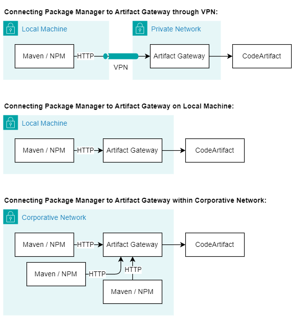

# Artifact Mirror

## Description

Access to CodeArtifact is restricted without an option to disable such behavior, so developers have to configure Maven
to use an authorization mechanism. Since the CodeArtifact token expires every 12 hours, Maven settings need to be
refreshed regularly to maintain access. The **Artifact Mirror** is designed to act as a mediator between artifact
consumers (a developer's local machine, a non-cloud CI/CD, etc.) and CodeArtifact, routing all requests to the service
and equipping them with an authorization token.

Note that the Artifact Mirror can be used only within a private network or on your local machine. The details of
usage are described [below](#connecting-maven-to-artifact-mirror)

## Building Application

```sh
mvn package
```

## Running Application

### Synopsys

```
artifact-mirror-1.3.1.jar
--aws.codeartifact.domain=<value>
--aws.codeartifact.domainOwner=<value>
--aws.codeartifact.region=<value>
[--aws.accessKeyId=<value> & --aws.secretKey=<value>]
[--server.port=<value>]
```

### Options

- `--aws.accessKeyId`, `--aws.secretKey`. Allow to pass AWS credentials. The application uses
  [the default credential provider chain](https://docs.aws.amazon.com/sdk-for-java/v1/developer-guide/credentials.html#credentials-default),
  so all approaches to provide credentials are available.
- `--server.port`. Allows to change server HTTP port. The default value is 80.

In a simple case, the application can be run by the following command:

```sh
java -jar artifact-mirror-1.3.1.jar --aws.codeartifact.domain=<value> --aws.codeartifact.domainOwner=<value> --aws.codeartifact.region=<value>
```

<!--Alternatively, the Artifact Mirror can be run in a Docker container:

```sh
docker build -t artifact-mirror .
docker run --rm -e ENV DOMAIN=<value> -e DOMAIN_OWNER=<value> -e REGION=<value> -p 80:80 artifact-mirror
```
-->

## Connecting Maven to Artifact Mirror

Once the Artifact Mirror is running, you can configure Maven to access artifacts through it in a normal way
without the authentication need. It is supposed that the URL to your private CodeArtifact repository has already
specified in the `pom.xml`:

```xml
<project>
  <repositories>
      <repository>
          <id>codeartifact</id>
          <url>https://my-domain-111122223333.d.codeartifact.us-east-1.amazonaws.com/maven/my-repository</url>
      </repository>
    ...
  </repositories>
  ...
</project>
```

To enable traffic going through Artifact Mirror, add a `<mirror>` section in Maven's `settings.xml` usually located in
`C:\Users\<username>\.m2` (Windows) or `~/.m2` (Linux, macOS):

```xml
<settings>
    <mirrors>
        <mirror>
            <id>codeartifact-mirror</id>
            <!-- Replace 'my-repository' on the actual repository name -->
            <url>http://<artifact-mirror-ip>/maven/my-repository/
            </url>
            <mirrorOf>codeartifact</mirrorOf>
        </mirror>
        ...
    </mirrors>
    ...
</settings>
```

> **Attention!** The mirror connection must rely on HTTP protocol, not HTTPS, while the CodeArtifact repository URL in
> the `pom.xml` should remain HTTPS.

The value of `<artifact-mirror-ip>` depends on the network architecture you plan to use. There are at least three
possible solutions illustrated in the picture below. In the **first** and **third** solutions, it is assumed that the
Artifact Mirror is deployed on a separate machine, which exposes **a private IP address** that can be used as the value
for `<artifact-mirror-ip>`. In the second solution, the variable must be replaced with `localhost`.

> **Note:** If you specify a custom port when running the JAR file, append the port to the IP address or `localhost`,
> for example, `localhost:4000`.

> **Warning!** Do not deploy the Artifact Mirror on a publicly accessible machine!



## Deploying Application on Server (Amazon Linux)

Copy the JAR-file to the server machine:

```sh
scp -i <rsa-key-file> ./artifact-mirror-1.3.1.jar ec2-user@<server-ip>:/usr/local/
```

Then connect via SSH to the server and execute the script below **replacing `<value>` placeholders**.

```sh
ssh -i <rsa-key-file> ec2-user@<server-ip>
```

```sh
sudo -i
yum install -y java-17-amazon-corretto
mkdir ~/.aws
cat << EOF > ~/.aws/credentials
[default]
aws_access_key_id=<value>
aws_secret_access_key=<value>
EOF
mkdir /opt/artifact-mirror/
wget -P /opt/artifact-mirror/ https://github.com/serhii-yatskovskyi/artifact-mirror/releases/download/artifact-mirror-1.3.1/artifact-mirror-1.3.1.jar
cat << EOF > /etc/systemd/system/artifact-mirror.service
[Unit]
Description=Artifact Mirror
[Service]
ExecStart=/usr/bin/java -jar /opt/artifact-mirror/artifact-mirror-1.3.1.jar --aws.codeartifact.domain=<value> --aws.codeartifact.domainOwner=<value> --aws.codeartifact.region=<value>
Restart=always
[Install]
WantedBy=multi-user.target
EOF
systemctl daemon-reload
systemctl enable artifact-mirror
systemctl start artifact-mirror
exit
```